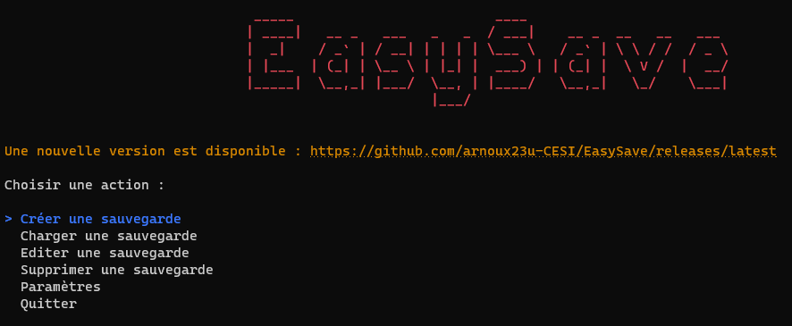
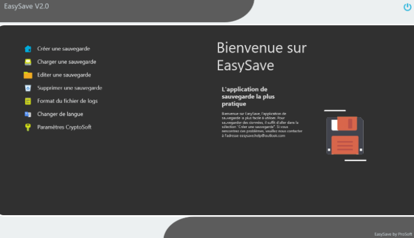
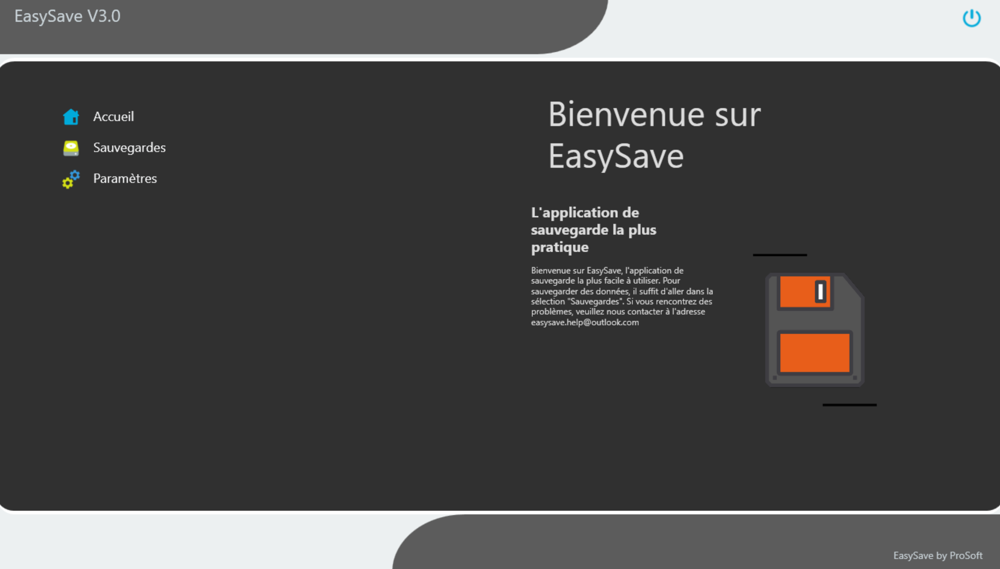
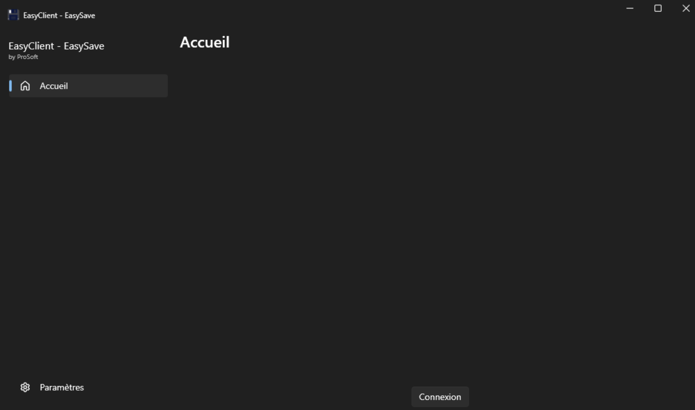

# EasySave
ProSoft - EasySave

<h2 id="intro">Introduction</h2>

EasySave is a backup software. It allows you to save your files on a local location. The application allows you to create, delete, and modify backups. 

<h2 id="team-members">Team Members</h2>

  * ARNOUX Guillaume
  * LEIDINGER Louison
  * PARISSE Nathalie 
  * PERREUX Alexandre

<h2 id="techno">Technologies</h2>

The software is written in C# and uses the .NET Core 3.1.
The MVVM pattern is used for the architecture of the software.  
Since the version 2.0, the software is a WPF application.

Libraries used : 
  * Newtonsoft
  * Spectre.Console
  * Octokit
  * Notification.Wpf

<h2 id="docs">Documentation</h2>

User documentations are available in the [docs](docs/manuals) folder.

<h2 id="img">Preview</h2>

<h3 id="img-v1.1">Version 1.1</h3>

<h3 id="img-v2">Version 2.0</h3>

<h3 id="img-v3">Version 3.0</h3>

<h3 id="img-vClient">EasyClient</h3>

